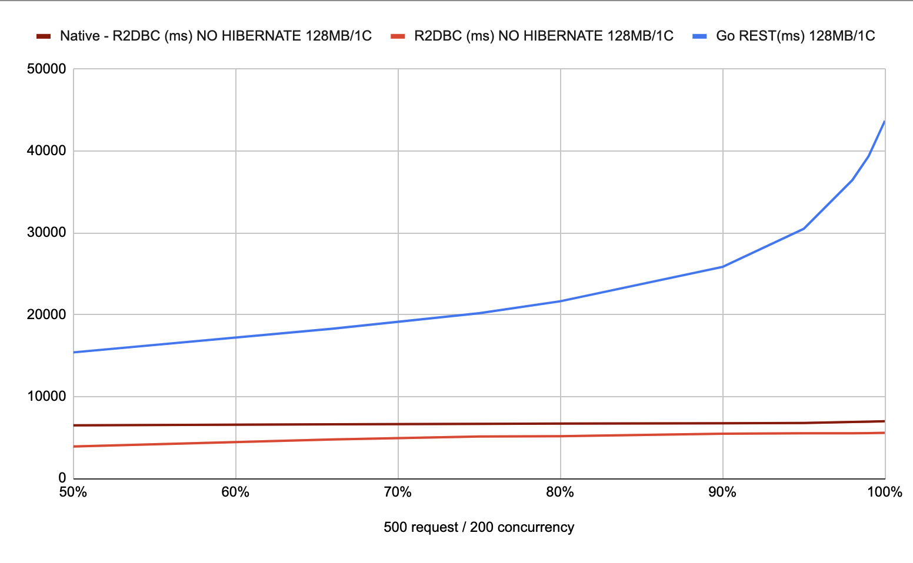

# SpringBoot Blocking and Reactive Examples

SpringBoot with JPA/Hibernate, JDBC and R2DBC examples.

There are five applications in this repository, 4 of them are SpringBoot and the last one is a Go application. They all use the same database which you can find in the "docker-compose" folder.

* spring-rest-data

Spring Boot with REST Controller and a Spring Data Repository with a JPA Entity.

* spring-rest-jdbc

Spring Boot with REST Controller and a pooled JDBC connection with a Model.

* spring-webflux-r2dbc

Spring Boot with Webflux Controller and a Spring Data R2DBC Repository with a JPA Entity.

* spring-webflux-r2dbc-no-hibernate

Spring Boot with Webflux Controller and a pooled R2DBC connection with a Model.


All the applications are tested with 256MB memory/2 CPU cores and 128MB memory/1 CPU core.

```
# spring-rest-data
docker run -it --rm --memory="256MB" --cpus="2.0" -p 8080:8080 --name spring-rest-data -e "DATABASE=jdbc:postgresql://$HOST_IP:5432/postgres" spring-rest-data
docker run -it --rm --memory="128MB" --cpus="1.0" -p 8080:8080 --name spring-rest-data -e "DATABASE=jdbc:postgresql://$HOST_IP:5432/postgres" spring-rest-data

# spring-rest-jdbc
docker run -it --rm --memory="256MB" --cpus="2.0" -p 8080:8080 --name spring-rest-data -e "DATABASE=jdbc:postgresql://$HOST_IP:5432/postgres?user=postgres&password=postgres&connections=99" spring-rest-jdbc
docker run -it --rm --memory="128MB" --cpus="1.0" -p 8080:8080 --name spring-rest-data -e "DATABASE=jdbc:postgresql://$HOST_IP:5432/postgres?user=postgres&password=postgres&connections=99" spring-rest-jdbc

# spring-webflux-r2dbc
docker run -it --rm --memory="256MB" --cpus="2.0" -p 8080:8080 --name spring-webflux-r2dbc -e "DATABASE=$HOST_IP" spring-webflux-r2dbc
docker run -it --rm --memory="128MB" --cpus="1.0" -p 8080:8080 --name spring-webflux-r2dbc -e "DATABASE=$HOST_IP" spring-webflux-r2dbc

# spring-webflux-r2dbc-no-hibernate
docker run -it --rm --memory="256MB" --cpus="2.0" -p 8080:8080 --name spring-webflux-r2dbc-no-hibernate -e "DATABASE=$HOST_IP" spring-webflux-r2dbc-no-hibernate
docker run -it --rm --memory="128MB" --cpus="1.0" -p 8080:8080 --name spring-webflux-r2dbc-no-hibernate -e "DATABASE=$HOST_IP" spring-webflux-r2dbc-no-hibernate
```

Apache `ab` is used for the load tests.

```
# such an example is this
for i in {1..10}; do ab -n 500 -c 20 "http://centos:8080/city" ; sleep 1; done
```

The following are the results for the `ab` tests.


|      | JPA Repository (ms) Entity 128MB/1C | JPA Repository (ms) DTO 128MB/1C | JPA Repository (ms) Entity 256MB/2C | JPA Repository (ms) DTO 256MB/2C | JDBC (ms) Model 128MB/1C | JDBC (ms) Model 128MB/1C | R2DBC (ms) Entity 128MB/1C | R2DBC (ms) DTO 128MB/1C | R2DBC (ms) Entity 256MB/2C | R2DBC (ms) DTO 256MB/2C | R2DBC (ms) Model - NO HIBERNATE 128MB/1C | R2DBC (ms) Model - NO HIBERNATE 256MB/2C | Go REST 128MB/1C | Go REST 256MB/2C |
| ---- | ----------------------------------- | -------------------------------- | ----------------------------------- | -------------------------------- | ------------------------ | ------------------------ | -------------------------- | ----------------------- | -------------------------- | ----------------------- | ---------------------------------------- | ---------------------------------------- | ---------------- | ---------------- |
| 50%  | 6163.333333                         | 6163.333333                      | 342.2                               | 331.8                            | 1028.6                   | 142.4                    | 4770                       | 4770                    | 493                        | 519.8                   | 332                                      | 334.2                                    | 1828             | 146.6            |
| 66%  | 6985.333333                         | 6985.333333                      | 377.2                               | 375.6                            | 1303.2                   | 189.2                    | 5419.4                     | 5419.4                  | 570.6                      | 619.8                   | 344                                      | 347.4                                    | 2157.8           | 180.6            |
| 75%  | 7801.333333                         | 7801.333333                      | 392.6                               | 393.8                            | 1464.6                   | 214.6                    | 5930.8                     | 5930.8                  | 620.2                      | 691.6                   | 355                                      | 359.2                                    | 2352.4           | 204.2            |
| 80%  | 8338.666667                         | 8338.666667                      | 404.4                               | 405.2                            | 1584.6                   | 233                      | 6283.4                     | 6283.4                  | 657.4                      | 737.6                   | 362.4                                    | 366                                      | 2455.2           | 219.6            |
| 90%  | 9474                                | 9474                             | 450.2                               | 453.2                            | 1868.2                   | 286.2                    | 7026                       | 7026                    | 773.2                      | 874                     | 377                                      | 379.4                                    | 2791             | 262.8            |
| 95%  | 10891                               | 10891                            | 492.6                               | 492                              | 2140.6                   | 326                      | 7661.6                     | 7661.6                  | 894.2                      | 986.2                   | 555.2                                    | 390                                      | 3073.6           | 306.6            |
| 98%  | 12426.66667                         | 12426.66667                      | 562.2                               | 564.4                            | 2544.8                   | 366                      | 8611.8                     | 8611.8                  | 1024.4                     | 1121.2                  | 812.8                                    | 403.8                                    | 3503             | 357.2            |
| 99%  | 12927.66667                         | 12927.66667                      | 604.4                               | 613.8                            | 2692.4                   | 426                      | 9039                       | 9039                    | 1126.8                     | 1200.8                  | 834.4                                    | 413.8                                    | 3803.8           | 392.4            |
| 100% | 14714.66667                         | 14714.66667                      | 671.8                               | 681.4                            | 3629.4                   | 549.8                    | 10134.8                    | 10134.8                 | 1288                       | 1391.6                  | 850.8                                    | 437                                      | 4450.4           | 469.8            |


## Load Test with High Concurrency

The `spring-rest-data` and `spring-rest-jdbc` could not handle the following loads under the same memory and CPU limitations (128MB/1CPU core).


The following table shows the response times for R2DBC and Go applications under *100* concurrent requets.

| 500 request / 100 concurrency | R2DBC (ms) NO HIBERNATE 128MB/1C | Go REST(ms) 128MB/1C |
| ----------------------------- | -------------------------------- | -------------------- |
| 50%                           | 1717.2                           | 6412.2               |
| 66%                           | 1744.8                           | 7937.2               |
| 75%                           | 1809.6                           | 8883.8               |
| 80%                           | 1905.2                           | 9448.8               |
| 90%                           | 1941.8                           | 10801.4              |
| 95%                           | 2041.4                           | 12043.6              |
| 98%                           | 2054.2                           | 14010.2              |
| 99%                           | 2064                             | 15300.2              |
| 100%                          | 2093.8                           | 17780.4              |


Diagram of the table.


The following table shows the response times for R2DBC and Go applications under *200* concurrent requets.

| 500 request / 200 concurrency | R2DBC (ms) NO HIBERNATE 128MB/1C | Go REST(ms) 128MB/1C |
| ----------------------------- | -------------------------------- | -------------------- |
| 50%                           | 3903.6                           | 15403                |
| 66%                           | 4777.4                           | 18293.6              |
| 75%                           | 5126.6                           | 20192.4              |
| 80%                           | 5162.8                           | 21646.6              |
| 90%                           | 5472.6                           | 25842.4              |
| 95%                           | 5516.8                           | 30496.4              |
| 98%                           | 5529.8                           | 36447.4              |
| 99%                           | 5537.8                           | 39362.4              |
| 100%                          | 5569                             | 43694.6              |


Diagram of the table.


